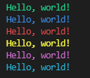

# Hascal's Changelog
<details>
<summary>v1.3.6</summary>
  
#### New features
- multi line string
- add `sdl2` wrapper
- add `export` library for exporting to C(see : [haspy](https://github.com/bistcuite/haspy))
- basic support for pointers
```typescript
var x : *int = 20
var y : int = 10
x = &y
var z = *x // type : int

// Pointers fix incomplete types on struct defination
struct bar {
    var self : *bar
}
```

#### Bug fixes
- fix lexer bugs
- check if function returns a value at end of string else show error
- `main` function should returns int

#### Removed
- `libcinfo` library removed

</details>


<details>
<summary>v1.3.5</summary>

#### Standard library
##### Updated
`os` :
- add `compiler_name` function to get the name of the compiler
- add `arch` function to get the architecture of the system
- add `is_x86` function to check if the architecture is x86
- add `is_x64` function to check if the architecture is x64
- add `getenv` function to get an environment variable
##### Added
- add `libcinfo` library to get information about the libc
- add `termcolor` library to colorize the output



#### Bug fixes
- Fix incomplete type defination bug

</details>

<details>
<summary>v1.3.4</summary>
  
#### New features
- compiler option : now can generate c++ code from hascal code with `c++_code : 1` in `config.json` file
- use `cuse` keyword to include c++ files.

#### Bug fixes
- Fix semantic analyser bugs
- Fix standard library bug

</details>

<details>
<summary>v1.3.3</summary>

#### New features
- struct inheritance
- can use `cuse` statement on struct declaration

#### Bug fixes
- Fix variable scope bug
- Fix variable declaration bug
- Fix semantic analyser bug

</details>

<details>
<summary>v1.3.2</summary>

#### New features
- `for in` statement
- library manager
- flag option
- `cuse` statement

#### Bug fixes
- Fix semantic analyser bugs
- Fix nested struct bug

#### Removed
- `for to` and `for downto` statement removed

</details>

<details>
<summary>v1.3.1</summary>

#### New features
- Basic Semantic Anaslyser

#### Removed
- remove semicolon from syntax

</details>
